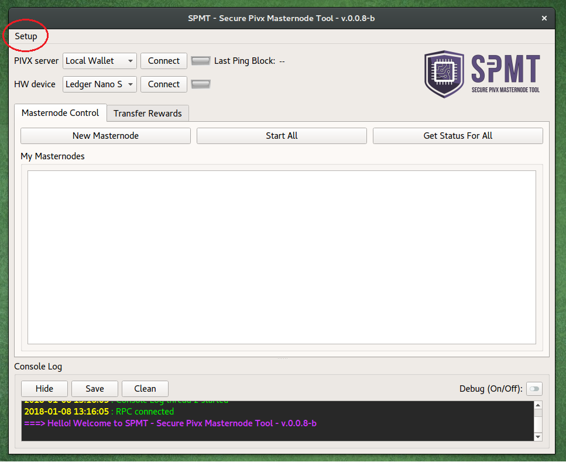
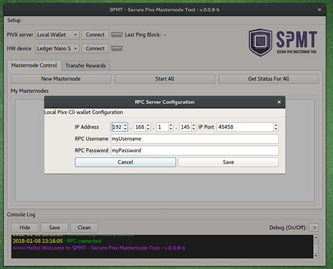
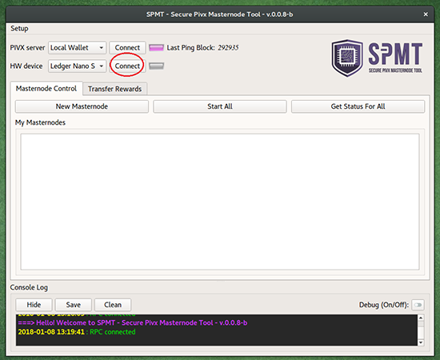
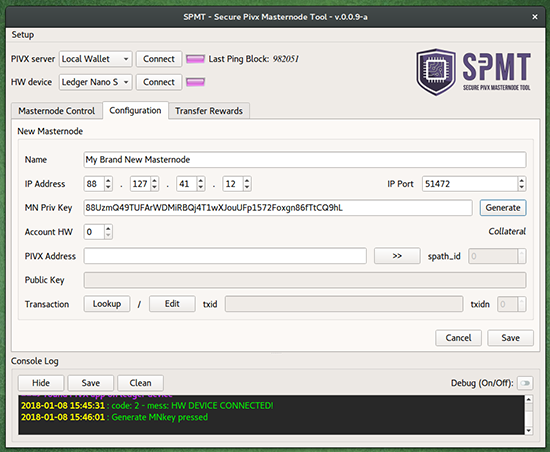
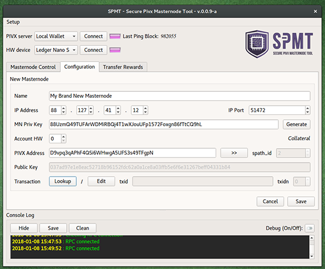
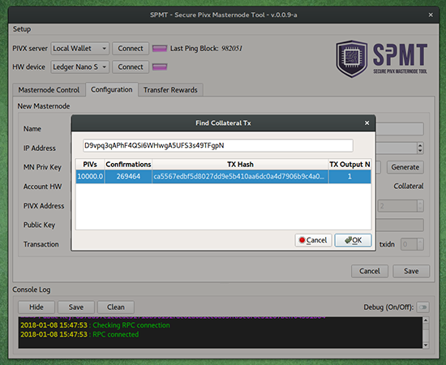
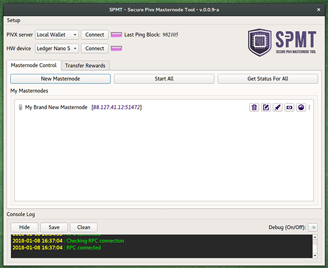

# SPMT
SPMT: Secure Pivx Masternode Tool is a software to securely manage multiple PIVX masternodes while keeping the collateral safely stored on Ledger Nano S hardware wallets.

## Installation
This application does not require installation.<br>
If you are using a binary version, just unzip the folder anywhere you like and use the executable to start the application:
- *Linux*: double-click `SecurePivxMasternodeTool` file inside the `app` directory
- *Windows*: double-click `SecurePivxMasternodeTool.exe` file inside the `app` directory
- *Mac OsX*: double-click `SecurePivxMasternodeTool.app` application folder

If you are running SPMT from the source-code instead, you will need Python3 and several libraries installed.<br>
Needed libraries are listed in `requirements.txt`.<br>
From the `SPMT` directory, launch the tool with:
```bash
python3 spmt.py
```
To make binary versions from source, [PyInstaller](http://www.pyinstaller.org/) can be used with the `SecurePivxMasternode.spec` file provided.

## Updating
When updating to a new version of the SPMT application, copy the following files from the old folder to the new one in order to preserve your rpc and masternodes configuration (export/import functionality coming soon):
- rpcServer.json
- masternodes.json

## Setup
#### Setting up the RPC server
In order to interact with the PIVX blockchain, the SPMT needs a local PIVX wallet running alongside (any empty pivx-cli wallet will do).
Edit your local `pivx.conf` inserting rpcuser, rpcpassword, rpcport and rpcallowip. 
Example:
```bash
server=1
rpcuser=myUsername
rpcpassword=myPassword
rpcport=45458
rpcallowip=127.0.0.1
```

Configure the RPC server by clicking on the menu
<br>

and inserting the same data
<br>

#### Connecting
Connect the hardware device and open the Pivx-App on it.<br>
Click the button `Connect` on the SPMT to connect to the hardware device.
<br>

#### Setting up a Masternode configuration
Click on `New Masternode` and fill all the informations of the remote node: 
 - masternode name 
 - ip Address and port.
 - masternode private key (this is the same key as `masternodeprivkey` on `pivx.conf` of your remote node)

If you don't have one, you can generate a new masternode private key (then copy it to the config file of the remote node) by clicking on `Generate`.
<br>

Insert the PIVX Address holding the collateral (and relative account number)<br>
If you have just one account on your Ledger wallet, leave account number to `0`.<br>
Click `>>` to look for path and public key.
<br>

Click `Lookup` to find the collateral TxHash or click `Edit` to fill it manually.
<br>

Click `Save` to save the configuration and go back to main view.
<br>


## Features
### Getting masternode status
...
coming soon
...
### Starting masternode
...
coming soon
...
### Spending masternode rewards
...
coming soon
...


## Credits
A huge part of this work is inspired by the following Dash projects:
- https://github.com/chaeplin/dashmnb
- https://github.com/Bertrand256/dash-masternode-tool

