<br><br>

# SPMT

<p>SPMT: Secure Pivx Masternode Tool is a software to securely manage multiple PIVX masternodes while keeping the collateral safely stored on Ledger Nano S hardware wallets.</p>

* [Installation](#installation)
* [Setup](#setup)
  - [Setting up the RPC server](#setup1)
  - [Connections](#setup2)
  - [Setting up a Masternode configuration](#setup3)
* [Features](#features)
  - [Getting masternode status](#features1)
  - [Starting masternode](#features2)
  - [Spending masternode rewards](#features3)
    - [Sweeping all masternode rewards](#features4)
  - [Governance](#features5)
    - [Reviewing the budget](#features6)
    - [Casting votes](#features7)
* [Coming Soon](#comingsoon)
* [Credits](#credits)

<br>

## <a name="installation"></a>Installation

This application does not require installation.<br>
If you are using a [binary version](https://github.com/PIVX-Project/PIVX-SPMT/releases), just unzip the folder anywhere you like and use the executable to start the application:

- *Linux*: double-click `SecurePivxMasternodeTool` file inside the `app` directory
- *Windows*: double-click `SecurePivxMasternodeTool.exe` file inside the `app` directory
- *Mac OsX*: double-click `SecurePivxMasternodeTool.app` application folder

If you are running SPMT from the source-code instead, you will need Python3 and several libraries installed.<br>
Needed libraries are listed in `requirements.txt`.<br>
From the `SPMT` directory, launch the tool with:

```bash
python3 spmt.py
```
To make binary versions from source, [PyInstaller](http://www.pyinstaller.org/) can be used with the `SecurePivxMasternode.spec` file provided.

<br>


## <a name="setup"></a>Setup

<p><b>NOTE:</b> :warning: make sure to have the latest firmware installed on your Nano S device.</p>

<p>Running a masternode usually requires setting up two PIVX full nodes, one -the actual masternode- that runs 24/7 and holds no funds, and another one -the control wallet- that holds the collateral and is used only to send a message (signed with the key of the collateral) to activate the remote node.</p>

<p>SPMT allows the user to store the collateral in a Ledger Nano hardware wallet and connects to the PIVX network (at the moment via an empty PIVX wallet that acts as RPC server) to send the "start" message to the remote node.</p>

The setup of the remote (VPS) is performed in the usual way, described in the *knowledge-base* guide:<br>
[Masternode Setup Guide](https://pivx.org/knowledge-base/masternode-setup-guide/)

For a self-hosted masternode setup with SPMT check the following guide:<br>
[Self-hosted MN from scratch (by TheEconomist)](https://forum.pivx.org/t/setting-up-a-self-hosted-mn-from-scratch-automatic-backup-crash-notification-spmt-tool/4229)

<br>

#### <a name="setup1"></a>Setting up the RPC server

<p>In order to interact with the PIVX blockchain, the SPMT needs a local PIVX wallet running alongside (any empty pivx-cli wallet will do).</p>

Edit your local `pivx.conf` inserting rpcuser, rpcpassword, rpcport and rpcallowip.<br>
Example:

```bash
server=1
rpcuser=myUsername
rpcpassword=myPassword
rpcport=45458
rpcallowip=127.0.0.1
```

<p>Configure the RPC server by clicking on the menu</p>

<br>

<p>and inserting the same data.</p>

You can leave ip `127.0.0.1` if the wallet is on the same machine as the SPMT.<br>
Otherwise set the IP address of the machine running the Core PIVX wallet.<br>

<br><br>


#### <a name="setup2"></a>Connections

<p>If the IP and the credentials of the PIVX wallet are correct, it should connect with SPMT instantly.</p>

Otherwise use the `Connect` button next to "PIVX RPC server: Local Wallet".<br>
Connect the hardware device to USB and open the PIVX-App on it.<br>
<br>
Click the button `Connect` next to "Hardware Device: Ledger Nano S" to connect to the hardware device.<br>

<br>

<p>Once successfully connected, it gives a confirmation message and the light turns purple.</p>

<br><br>


#### <a name="setup3"></a>Setting up a Masternode configuration

Click `New Masternode` (big button below the list) and fill all the informations of the remote node:<br>

 - <b>Name</b> : an alias for the masternode entry
 - <b>IP Address / IP Port</b> : Public IP address and port of the remote masternode
 - <b>MN Priv Key</b> : masternode private key. If you have already seup the remote node, copy here the `masternodeprivkey` from the pivx.conf file.<br>
If you don't have one yet, you can generate a new masternode private key clicking on `Generate` (then copy it to the config file of the remote node).

<br>Insert the PIVX Address holding the collateral (and relative account number). If you have just one account in your Ledger wallet, leave account number to `0`.<br>
Then click `>>` to look for path and public key.<br>

<br>

<p>The tool looks for the public key and path of the given address (in batches of 10 paths per scan, asking confirmation to continue if needed).<br>
When found, a notification message is displayed.</p>

<br>

If the user already knows the correct `spath_id` (address number) he can, instead, insert it and click `<<` to look for the corresponding address and public key.<br>

Click `Lookup` to find the collateral TxHash or click `Edit` to fill it manually, and then `OK`.<br>
Click `Save` to save the configuration and go back to main view.<br>

<br>

<br>


## <a name="features"></a>Features

### <a name="features1"></a>Getting masternode status

Click on `Get Status For All Masternodes` to inspect the status of all masternode entries.<br>

<br>

<p>To inspect the status details click on the little magnifying glass icon.</p>

<br>
<br><br><br>

### <a name="features2"></a>Starting masternode

Click `Start All Masternodes` to send a start-message for all masternode entries or click the little rocket icon next to a particular entry to start that one masternode.<br>

<br>

Click `yes` to confirm<br>

<br>

<p>Double check the masternode message hash both on screen and on the display of the device.<br>
Then click "yes" (right button) on the ledger nano S.</p>

<br>

SPMT presents the decoded message.<br>
Double check it and then click `Yes`.<br>

<br>

<p>After broadcasting the message, SPMT presents a confirmation popup.</p>

<br><br>

### <a name="features3"></a>Spending masternode rewards

Select the `Transfer Rewards Tab` to go to the rewards panel (or use the shortcut, money icon, to simultaneously change tab and select the node).<br>

<br>

<p>Use the dropdown menu to select the masternode you wish to send rewards from.</p>

<br>

Click on `Show Collateral` if you wish to select and spend it.<br>
Click on `Hide Collateral` to hide it again.<br>

<br>

<p>Select those UTXOs you wish to spend.<br>
The suggested fee is automatically adjusted based on the TX size and the average fee of the last 200 blocks.<br>
Adjust it as preferred.</p>

Then insert the PIVX `Destination Address` and click on `Send`<br>

<br>

<p>Verify the details of the TX both on screen and on the display of the Nano S.<br>
If everything checks out, click "yes" (right button) on the device.</p>

<br>

<p>The transaction is now assembled and signed.<br>
SPMT asks one more time to check the details before broadcasting the transaction (thus spending the selected rewards).<br>
Click `Show Details` to inspect the decoded raw transaction.</p>

<br>

<p>Click `Yes` to finally broadcast the transaction to the PIVX network.</p>

Click `Show Details` to get the TX-id that identify the transaction.<br>
It should appear on the Block Explorers and on the receiving wallet after a few seconds.<br>

<br><br>


#### <a name="features4"></a>Sweeping all masternode rewards

<p>With this feature it is possible to send all rewards from all masternodes in list with a single TX (provided it doesn't get too big).</p>

Click on `Sweep All Rewards` to open the summary dialog.<br>

<br>

Insert the destination address, adjust the fee and click `Send`<br>

<br>

<p>Preparing the TX is an expensive operation. The more rewards included, the more time is needed. A progress bar gives the current status of the signature operation.</p>

<br>

<p>Eventually SPMT shows the confirmation dialog</p>

<br>

<p>Signing all the inputs is time consuming as well.<br>
If the operation takes too long, the number of inputs is probably too high. try sending separate TXs first.<br>
After some time it prompts the usual message</p>

<br><br>


### <a name="features5"></a>Governance

<p>Version <b>0.3.0</b> of SPMT introduced the ability for masternode owners to interact with the governance of the PIVX DAO (decentralized autonomous organization) directly from within the tool.</p>

To review budget proposals and vote on them, select the `Governance` Tab.<br>

<br>

#### <a name="features6"></a>Reviewing the budget

<p>If the RPC server is connected, the current proposal list will be automatically loaded and displayed.<br>
To reload the list, click on the double arrow icon in the upper right corner.</p>

<p>For each proposal is displayed: name, proposal hash, link, monthly payment, number of payments (remaining and total), network votes (yes / abstains / no) and the number of votes belonging to the user's masternodes.<br>
Each column can be ordered in both ascending and descending order.</p>

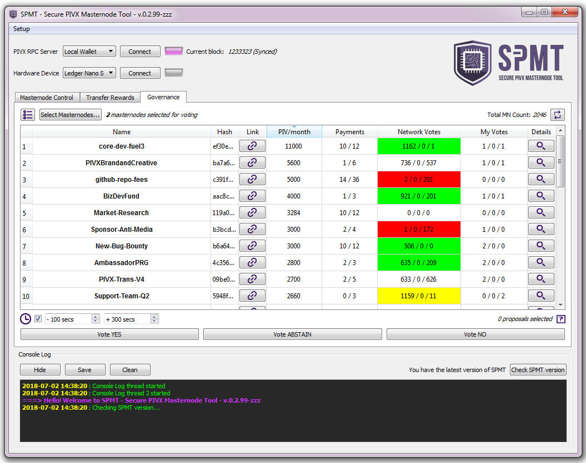<br>

<p>In the main list, each row has the "Network Votes" cell's background highlighted to reflect its status:</p>
<ul>
<li> <em style='color:green'>GREEN</em>: Proposal currently passing (number of net yes votes is higher than 10% of the total masternodes count)</li>
<li> <em style='color:red'>RED</em>: Proposal currently not passing (number of net yes votes is negative - i.e. there are more 'no' votes than 'yes' votes)</li>
<li> <em style='color:YELLOW'>YELLOW</em>: Proposal expiring (number of remaining payments is zero)</li>
<li> <em>WHITE (no background)</em>: Proposal currently not passing (number of 'yes' net votes is positive but less than 10% of the total masternodes count)</li>
</ul>

To follow the discussion thread of a particular proposal on the PIVX forum click on the `Link` button.<br>

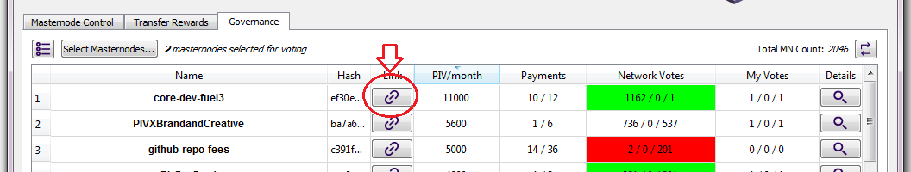<br>

<p>To inspect the details of a proposal click the little magnifying glass icon.</p>

In the "Proposal Details" dialog the `Hash`, `FeeHash` and `Payment Address` fields are selectable (but of course not editable) so they can be copied and pasted elsewhere if needed.<br>

<br>

<p>To view the budget projection for the current cycle, click the list icon on the upper left corner of the Governance Tab</p>

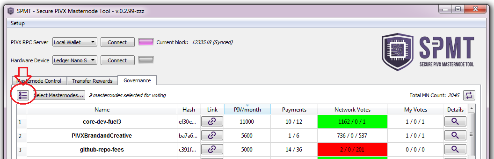<br>

<p>The budget overview shows the time remaining till next superblock as well as the list of proposals currently passing and the total allotted budget.</p>

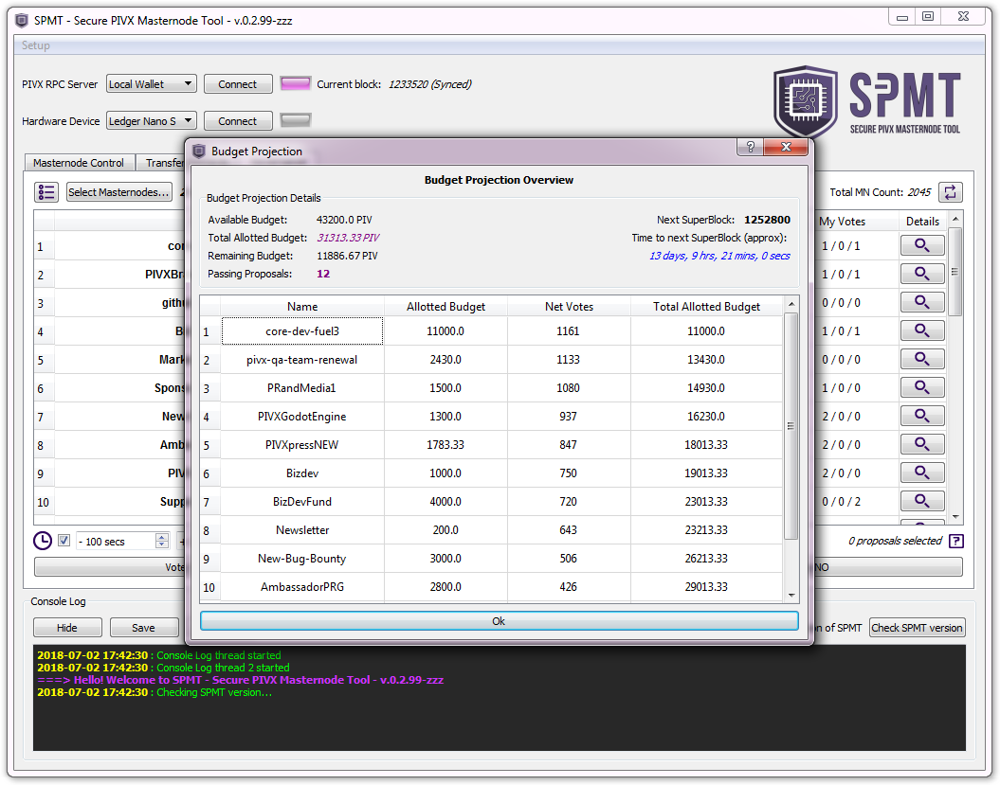<br>


#### <a name="features7"></a>Casting Votes

Click `Select Masternodes...` to select the masternode(s) you'd like to vote with.<br>

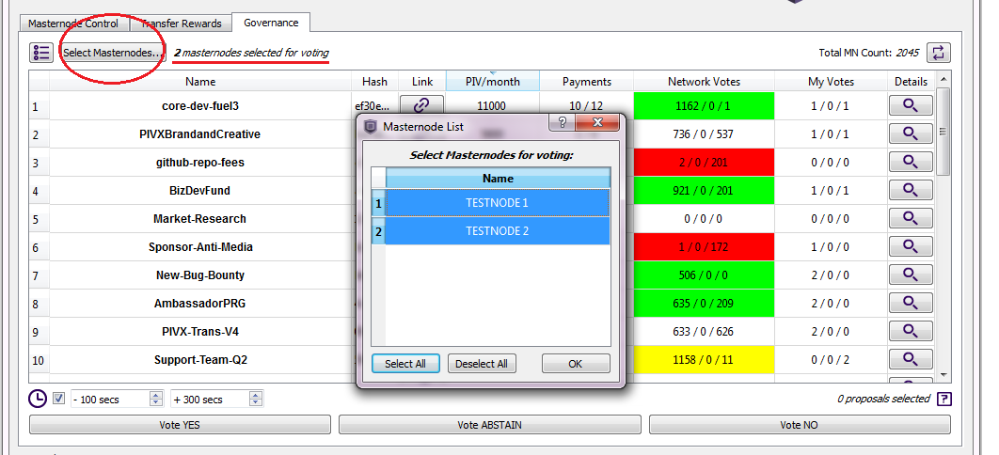<br>

<p>Then select all proposals you'd like to vote on, clicking on the corresponding row in the table.<br>
The total number of proposals selected is shown in the bottom right corner</p>

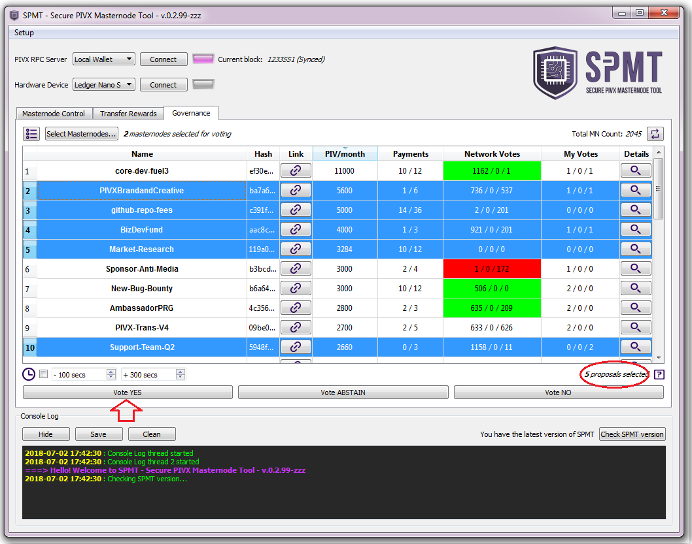<br>

Click `Vote YES` to vote 'yes' for the selected proposals or `Vote NO` to vote 'no' ('Abstain' option is currently disabled).<br>
A summary is presented. Click `Yes` to confirm or `No` to cancel.<br>

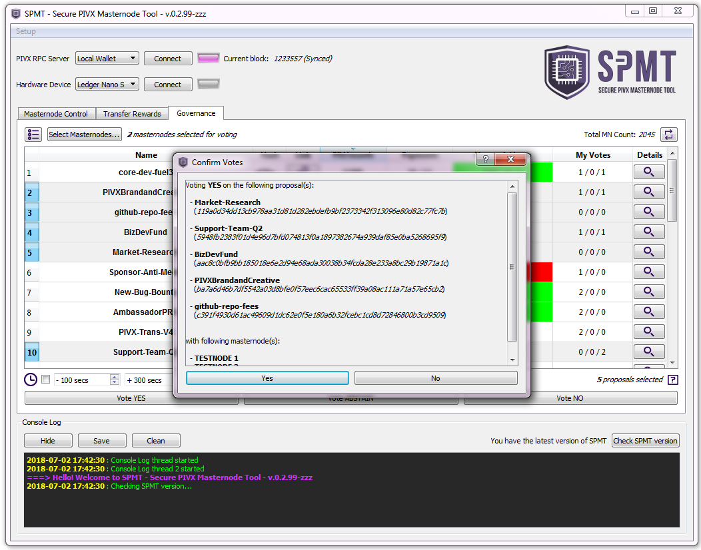<br>

<p>The tool presents a popup showing the outcome of the operation.</p>

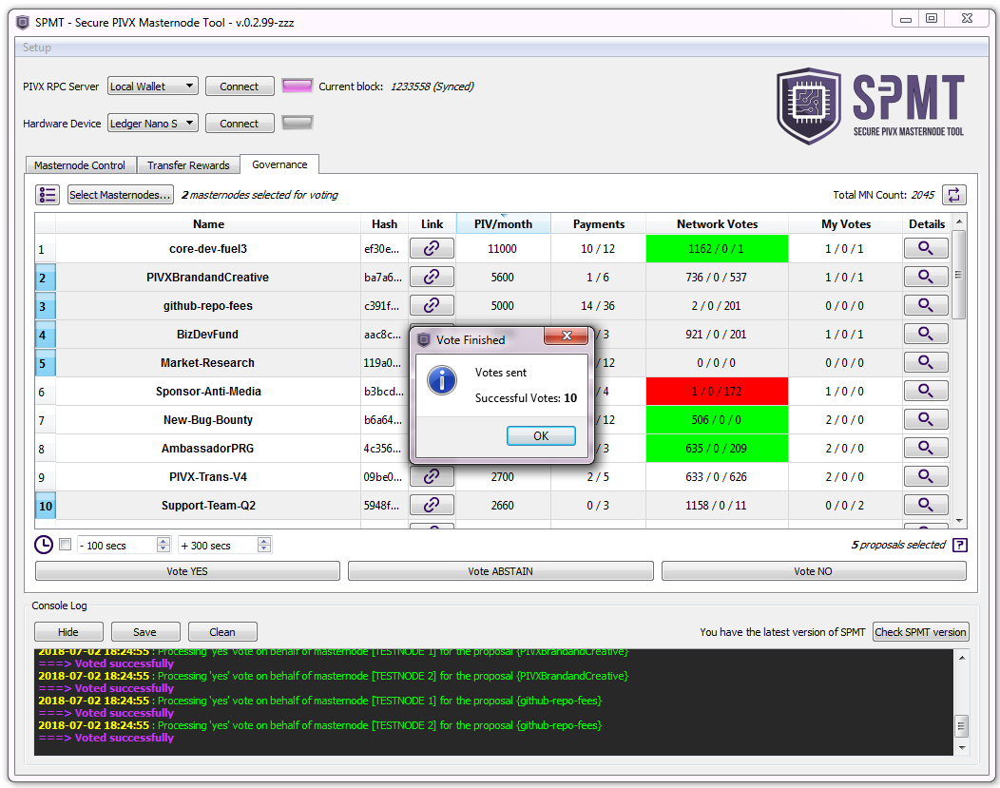<br>

##### <a name="features7b"></a>Adding a random time offset

<p>To enhance the privacy of the masternode owner, the tool gives the ability to add a randomized delay to each vote timestamp.</p>

<p>The offset can be either positive or negative resulting in a vote slip with a timestamp either delayed or anticipated.<br>
To enable the feature, click the checkbox near the little clock icon in the bottom left corner of the Governance Tab.<br>
Set the seconds for the lower bound <em><b>LB</b></em> and the upper bound <em><b>UB</b></em>.</p>

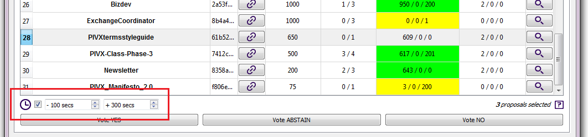<br>

<p>When voting, with this option enabled, a number of seconds <em><b>T</b></em>, is randomly chosen in <em><b>(-LB, UB)</b></em> for each vote and added to the current timestamp (i.e. to have only delayed votes, set <em><b>LB</b></em> to 0 seconds)</p>

<p>The random time <em><b>T</b></em> used for each vote is printed in the console log.</p>

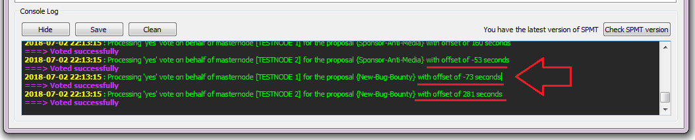<br>

<p>The timestamp of each personal vote can be also reviewed inside the details dialog of a proposal.</p>

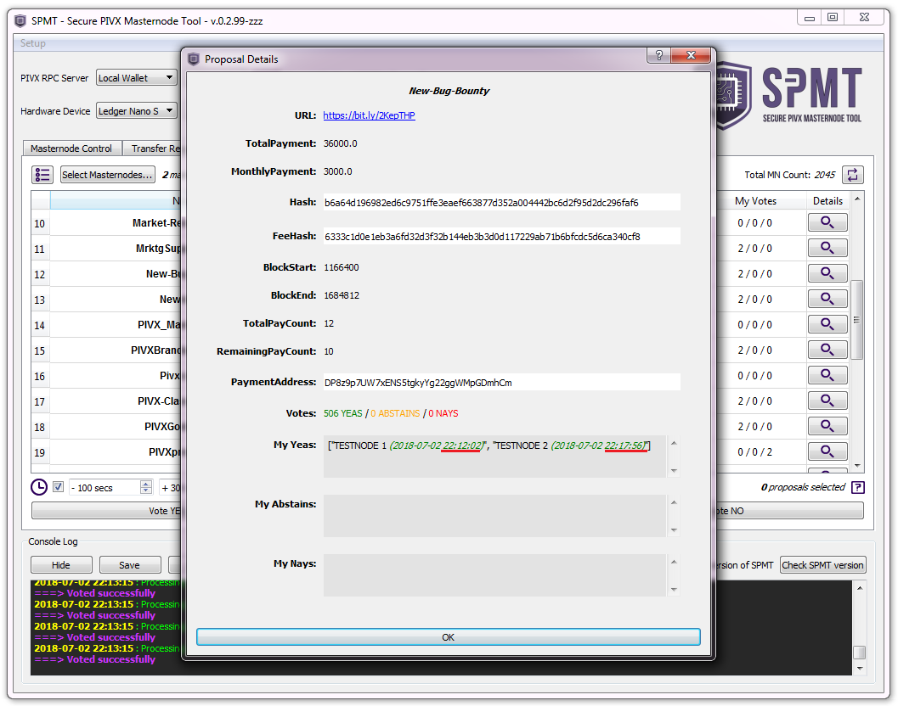<br><br>


## <a name="comingsoon"></a>Coming soon
- Proposals submission
- Lite Connection
- ...


## <a name="credits"></a>Credits
A big part of this work was originally inspired by the following Dash projects:
- https://github.com/chaeplin/dashmnb
- https://github.com/Bertrand256/dash-masternode-tool
