## Setup

### <a name="setup1"></a>Connections

#### <a name="setup2"></a>Hardware Wallet Connection

> *Note*: :warning: make sure to have the latest firmware installed on your Nano S device.<br>
Also make sure to close all applications that might interfere with the device's USB dongle (such as Ledger Chrome Wallet or Ledger Live App)

Connect the hardware device to the USB, unlock it and open the PIVX app on it.<br>
Click the button `Connect` next to 'Hardware Device: Ledger Nano S':<br>

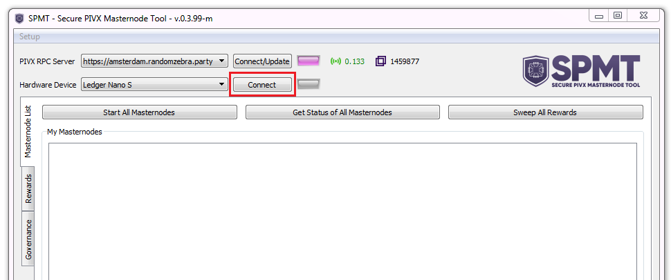<br>

<p>Once successfully connected, it gives a confirmation message and the light turns purple.</p>

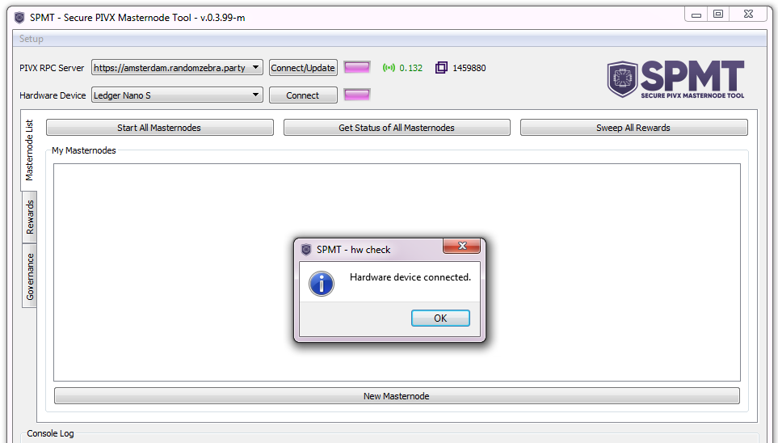<br>

<br><br>

#### <a name="setup3"></a>RPC Server Connection

##### Public Servers
<p>In order to interact with the PIVX blockchain, SPMT has a number of preloaded remote RPC servers.<br>
To change the server used by the application, select it from the drop-down menu. The tool automatically tries to connect to it and displays latest block number and server's response time.</p>

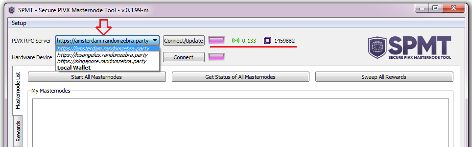<br>

<br><br>
##### Local Wallet
Alternatively SPMT can connect to a local PIVX wallet running alongside it (any empty pivx-cli wallet will do) using it as JSON-RPC server.

Install the local wallet and edit its `pivx.conf` inserting *rpcuser*, *rpcpassword*, *rpcallowip* and, if preferred, change the RPC port setting *rpcport=N* replacing *N* with the desired port number (if not set, the wallet will use default RPC port number: 51473)<br>
Example:

```bash
server=1
rpcuser=myUsername
rpcpassword=myPassword
rpcallowip=127.0.0.1
```

<br>Then, inside the SPMT, open the menu `Setup -> RPC Servers config...` to access the configuration dialog.<br>

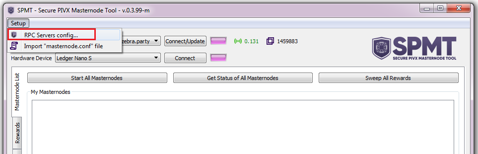<br>

<p>Click on the 'edit' icon next to "Local Wallet":</p>

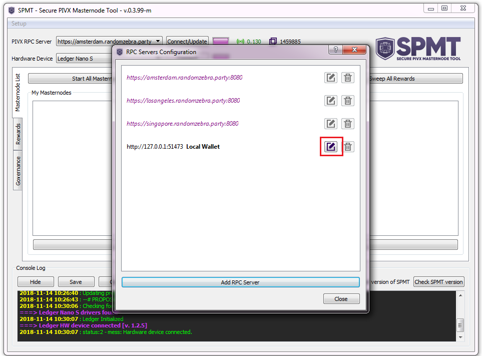<br>

> You can leave ip "127.0.0.1" if the wallet is on the same machine as the SPMT.

Insert the RPC user/password credentials and hit 'Save' to go back.<br>

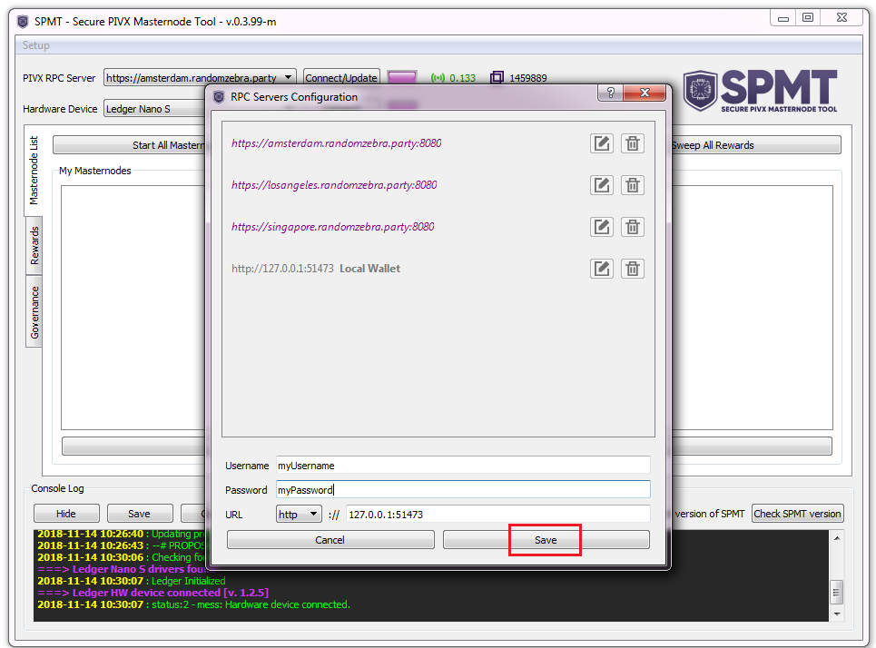<br>

<br>Now select `Local Wallet` from the drop-down menu, it should connect with SPMT instantly.</br>
Otherwise use the `Connect/Update` button.<br>

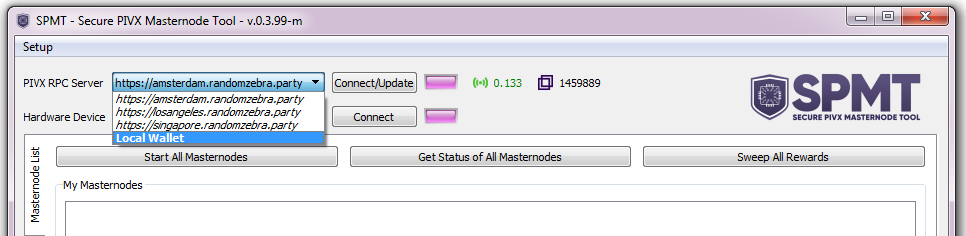<br>

<br><br>
##### Custom Private Servers
<p>The user has also the option to run his own instance of a remote RPC server.<br>
In order to setup the remote server, the following solution can be used:</p>

https://github.com/random-zebra/PIVX-NGINX_proxy

<br>Once setup, to add the remote server inside SPMT, go to `Setup -> RPC Servers config...` and click `Add RPC Server`:<br>

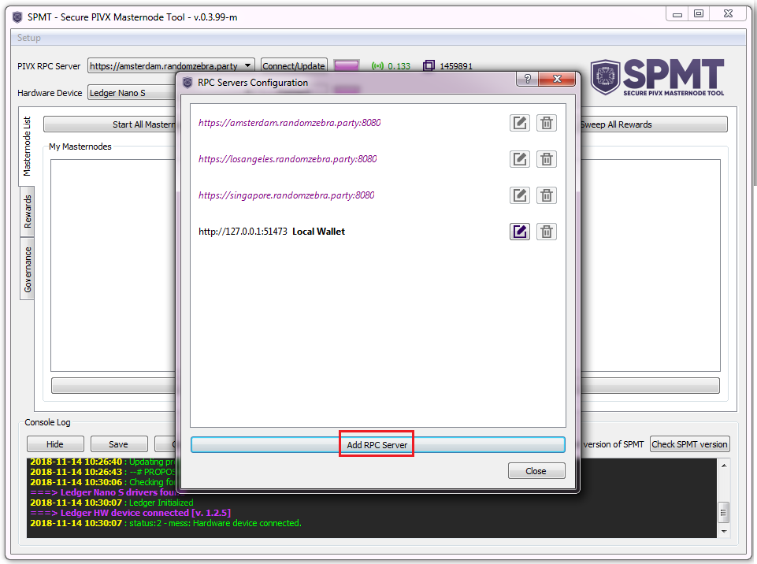<br>

<p>Insert the server URL, selecting "http" or "https", the username and password, and hit save.<br>
Close the configuration dialog and select the new server from the drop-down menu to attempt a connection to it.</p>

<br>

---
### <a name="setup4"></a>Masternodes configurations

#### <a name="setup5"></a>Setting up a masternode configuration

Click `New Masternode` (big button below the list) and fill all the informations of the remote node:<br>

 - <b>Name</b> : an alias for the masternode entry
 - <b>IP Address / IP Port</b> : Public IP address and port of the remote masternode
 - <b>MN Priv Key</b> : masternode private key. If you have already setup the remote node, copy here the `masternodeprivkey` from the *pivx.conf* file.<br>
If you don't have one yet, you can generate a new one clicking on `Generate` (then copy it to the config file of the remote node).

<br>Insert the PIVX Address holding the collateral and relative account number.<br>
If you have only one account in your Ledger wallet, leave account number to "0".<br>
After inserting Account number and PIVX Address, click `>>` to look for path and public key.<br>

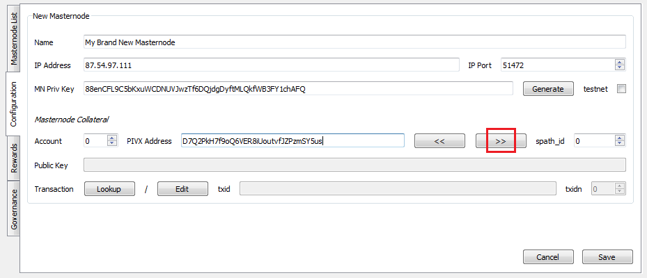<br>

>*Note*: If you are unsure about the account number, you can check the account details from Ledger live app (advanced logs --> your account number is next to `"index"`):<br>
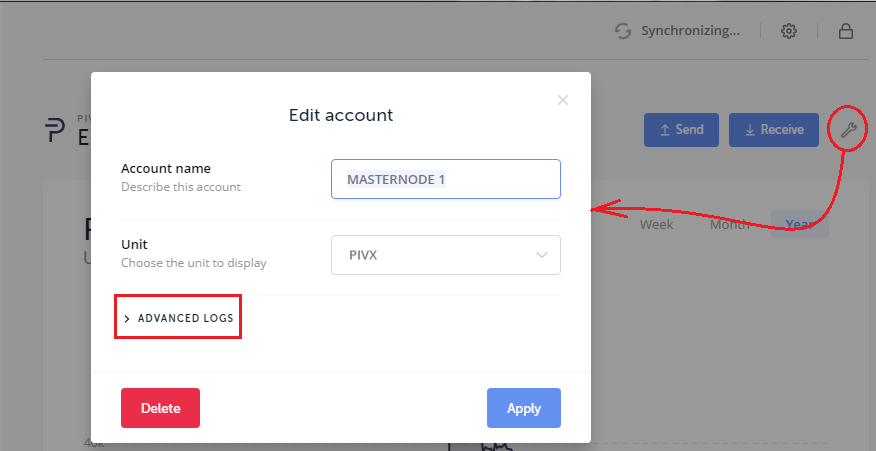<br>

<p>The tool looks for the public key and path of the given address (in batches of 10 paths per scan, asking confirmation to continue if needed).<br>
When found, a notification message is displayed.</p>

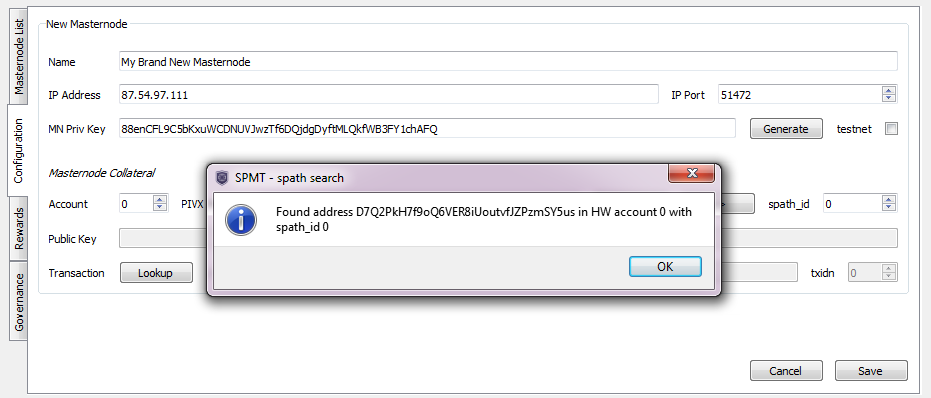<br>

> *Note*: If the user knows already the correct `spath_id` (address number) he can, instead, insert it and click `<<` to do the reverse search (look for the corresponding address and public key).

Click `Lookup` to find the collateral TxHash, select it and  press `OK`.<br>

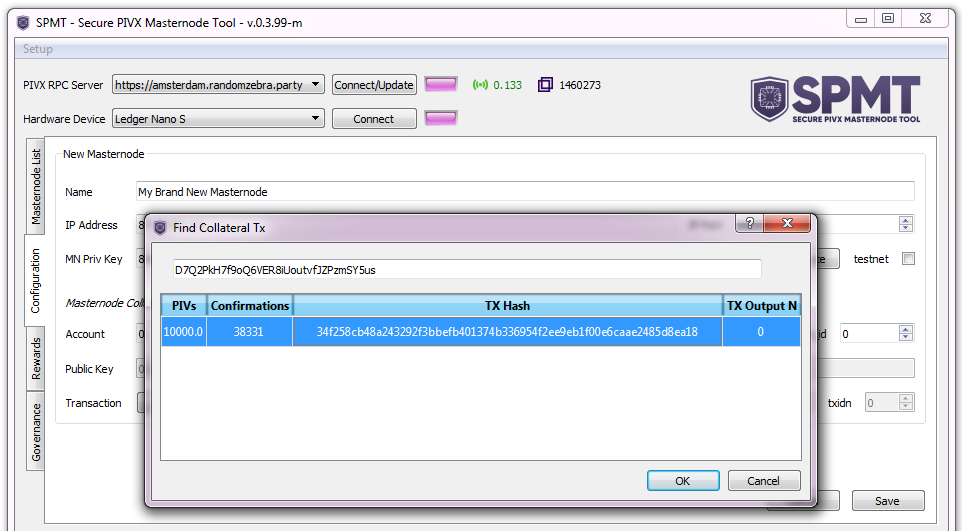<br>

<br>Alternatively click `Edit` to fill it manually, and then `OK`.<br>

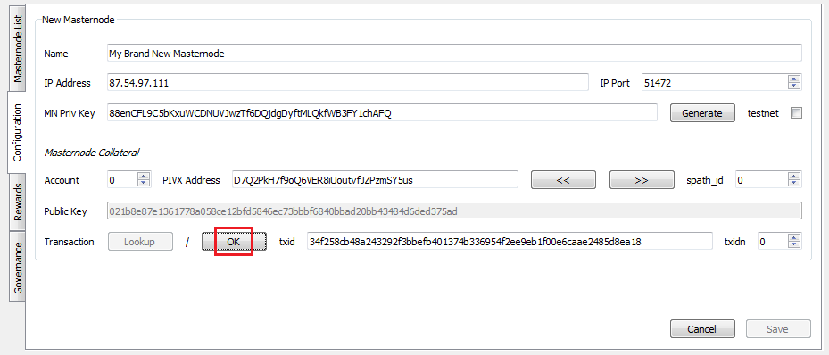<br>

<br>Click `Save` to save the configuration and go back to main view.

<br><br>
#### <a name="setup6"></a>Import external masternode file

Starting from version  **v0.3.1** it is possible to "import" external masternodes (with collateral traditionally held on PIVX core wallets, instead of hardware devices), loading the data from an external file formatted as the common `masternode.conf` of the controller wallets.<br>
<br>
To access the feature simply click on `Import "masternode.conf" file` from the `Setup` menu and select the file.

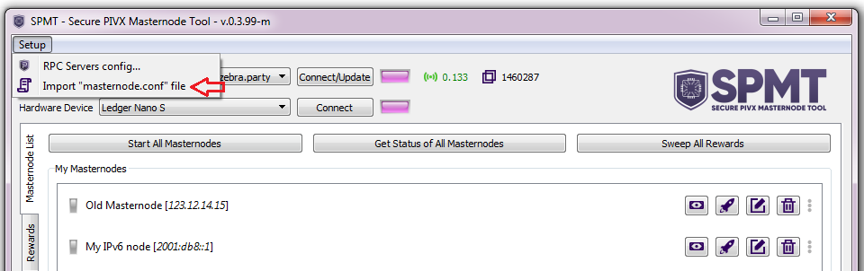<br>

These "external masternodes" will appear in orange in the list inside the SPMT.
<br>
They can't be started and the spending of rewards is disabled for them. But their status can be checked and they can be used for voting in the governace Tab.<br>

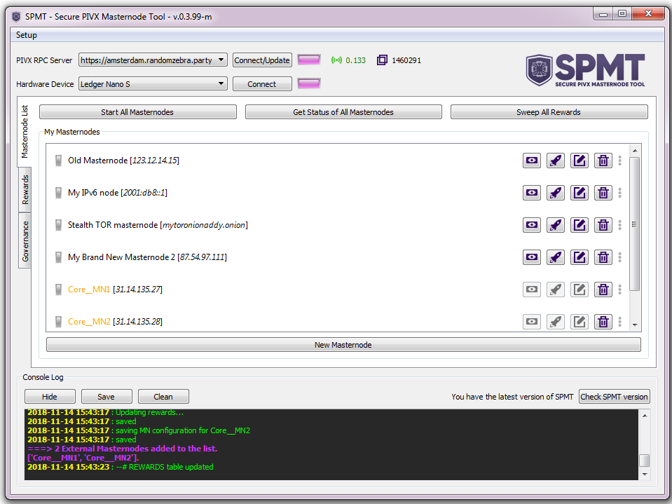<br>
