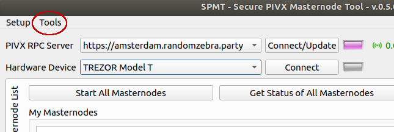
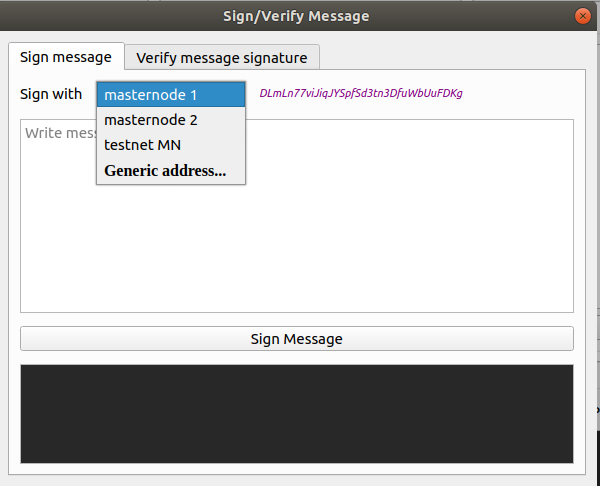
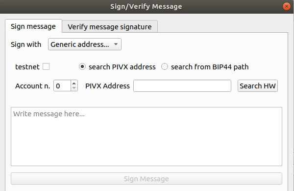
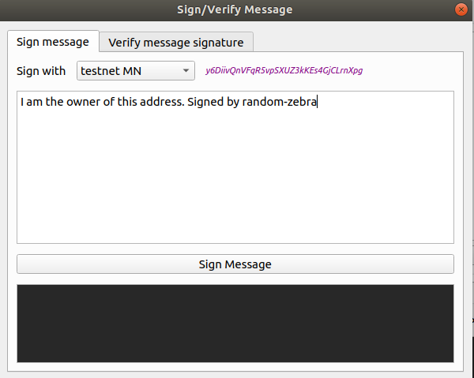
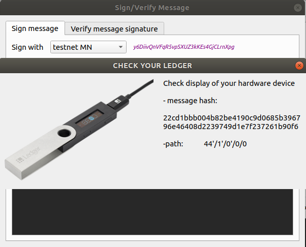
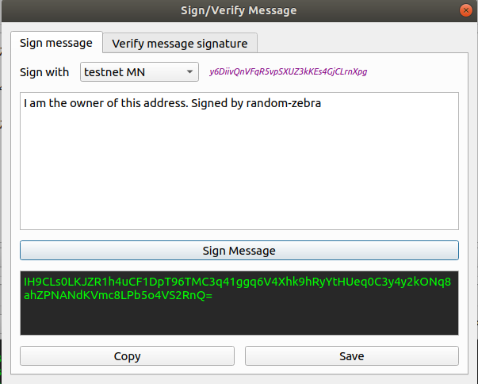
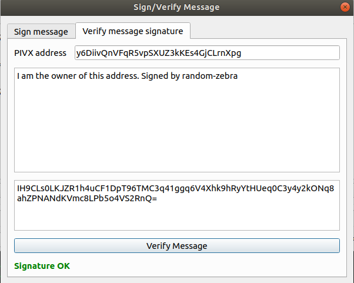
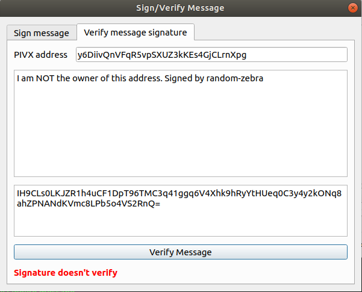

## Tools

Version `0.5.1` adds a "Tools" section to the main menu.

 
 

### Sign text messages

Select 'Sign/Verify message' from the 'Tools' menu, to open the dialog.

The 'Sign message' tab is already selected. 
If you want to sign with the key of a masternode (collateral address), select the masternode name from the dropdown menu. The masternode collateral address will be shown in the top right corner. 
If you want to use another address, instead, select "Generic address..." to look for it.

 
 

Searching for the public key of a generic address is done in the same way as in the masternode collateral setup. 
Insert the account number and the address, the click on 'Search HW' to look for the account addresses (in batches of ten, asking confirmation to continue) until it finds one that matches. 
If, instead, you know already the address number, select the 'search from BIP44 path' radio button, insert the number next to 'spath_id' and click 'Search HW' to retrieve the key.

 
 

Once found, the address is displayed in the upper right corner. 
Insert the message to sign and click 'Sign Message'

 
 

Double check the message (or message hash, for Ledger) on the device LCD and confirm the signature.

 
 

After performing the operation on the hardware device, the signature is displayed in the text area below the sign button. Click 'Copy' to copy it to the clipboard, or click 'Save' to save it to a text file.

 
 

### Verify signatures

This feature allows the user to verify messages signed with the private keys of PIVX mainnet or testnet addresses. 

Select 'Sign/Verify message' from the 'Tools' menu, to open the dialog and click the 'Verify message signature' tab to activate it. 
Insert the address, the message, the signature, and click 'Verify Message'. 
The result is displayed below.

 
 

 
 
